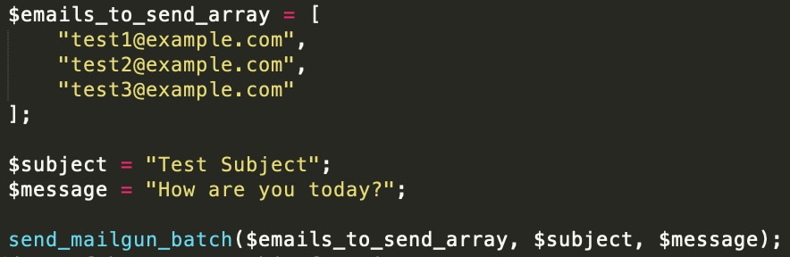

# How to send batch bulk emails using Mailgun in PHP.

It is not using Mailgun API, only PHP curl 

All receipts are hidden, so they don't see each other emails

## How to use:
1. add this file `"send_mailgun_batch.php";` your PHP project
2. `require_once "send_mailgun_batch.php";`
3. change `$mailgun_api_url` and `$mailgun_api_key`
4. Call this function `send_mailgun_batch($emails_to_send_array, $subject, $message);`
5. If success you should see a message "Queued. Thank you."
